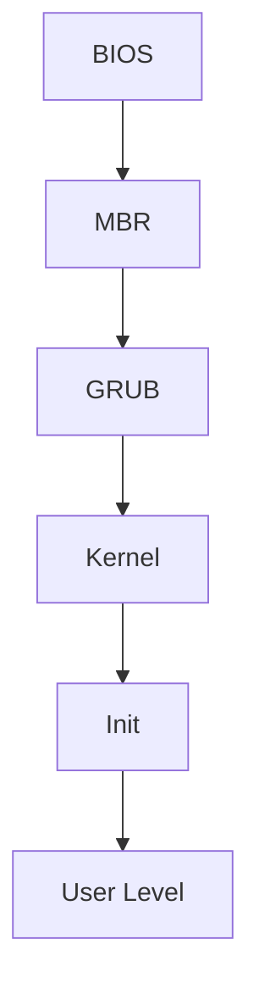

# BOOT PROCESS
## Startup Sequence for Linux
[Source - 1](https://www.thegeekstuff.com/2011/02/linux-boot-process/)  
[Source - 2](https://www.knowledgehut.com/blog/web-development/booting-in-operating-system)

1. **BIOS**
* Basic Input/Output System
* Examines main memory, disks, I/O and other connected hardware devices.
* Searches for MBR in memory devices.
* Loads the MBR and transfers control to it.

2. **MBR** Master Boot Record.
* In the first section of disk. Checks which bootloader to run.
* Contains GRUB info. Loads and Executes GRUB.
* This is specific to Linux. There is a different bootloader for Windows.

3. **GRUB** Grand Unified Bootloader. 
* This is the Linux bootloader.
* If there are multiple kernel images, GRUB lets you select which one to load.
* Selected kernel is loaded and executed.
* The critical file systems, and device drivers are all loaded into memory. 

4. **Kernel**
* This is the Operating System level.
* Mounts the root file system. Contains hardware drivers to access ROM and other hardare peripherals.
* Scheduler, PCB, TCB etc metadata comes into picture.
* Starts the init process.

5. **Init**
* process id (PID) of 1.
* Decides type of OS operation - Single User, Multi User etc.
* Appropraite set of programs are loaded and run.
* This goes until user gets control - through shell UI or GUI.

6. **User Level**
* Run Level programs are executed automatically (at Startup or Shutdown)
* User requested programs are serviced by the kernel accordingly. 

