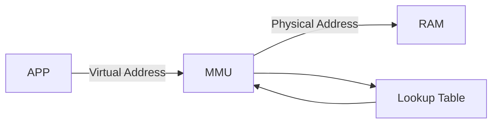

# MEMORY MANAGEMENT
## Process Memory in physical memory (RAM) 
[Source - GeeksforGeeks](https://www.geeksforgeeks.org/memory-layout-of-c-program/)  

When a program is loaded onto memory, it becomes a process. The layout looks like this. 
  
**Note:** The bss section is not automatically initialized. See bss notes.  
Predominantly there are 5 sections:  
* **Stack** - Stack is fixed size buffer which holds stack frames during a function call.grows from high address to lower address. LIFO.    
    * Stack frame - A set of values pushed for one function call. Return address(atleast), Local variables, Machine registers.
    * [Stack Overflow](https://www.techtarget.com/whatis/definition/stack-overflow) - A stack overflow is a type of buffer overflow error that occurs when a computer program tries to use more memory space in the call stack than has been allocated to that stack. Can happen through recurssion without exit, longer recurssion logic or larger local variable memory block.
* **Heap** - dynamically allocated memory (runtime allocations). The allocation functions provide contiguous blocks of memory. Heap overflow can happen if memory not deallocated properly.
* **Uninitialized Data (bss)** - BSS Segment. Contains uninitialized global, static variables. The default value of that variable is whatever (garbage) value happens to already be in that memory address! [source](https://www.learncpp.com/cpp-tutorial/uninitialized-variables-and-undefined-behavior/)
* **Initialized Data** - Data Segment. Contains initialized global and static variables.
* **Text** - code section. read-only (prevents modification). lower address to avoid heap and stack overwriting it.

## Physical memory
8 bit / 16 bit microcontrollers have only a few programs running. Therefore the space allocated on physical memory (RAM) is directly accessable. We can directly access the physical memory due to the knowledge of physical memory addresses.
The physical memory and the memory used is small too.  
16 bit address bus => 65536 addresses. (byte-addressable.)  
Byte Addressable is one byte can be represented by one address.  
**Disadvantages of using physical memory directly**  
* **Position.** Where does each program reside in memory ?
* **Overwriting** possibility between processes.
* **Relative Addressing.** Accidentally accessing other processes memory when doing address calculation.
* **Memory Fragmentation.** (Gaps in memory due to process placement, can't fit anything else. memory waste or full)  
***To solve this issue -> Virtual Memory.***

## Virtual Memory
[My Notes](https://drive.google.com/file/d/1SSlOTgJ-pYaVOjaNuXDhkvkRWUFOlatE/view?usp=share_link)
[Youtube source - Gary Sims](https://www.youtube.com/watch?v=2quKyPnUShQ)

## Paging
## TLB Cache