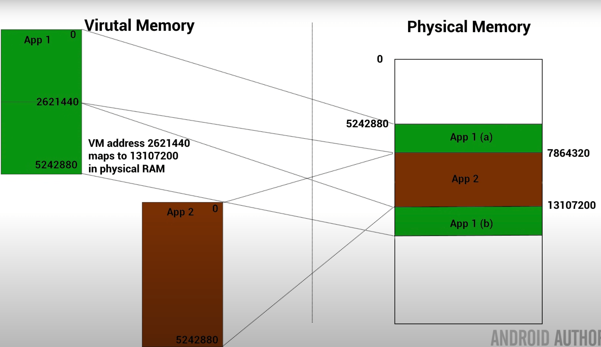
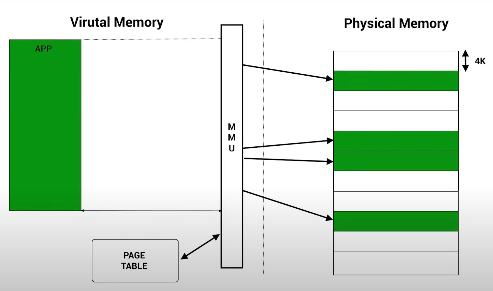
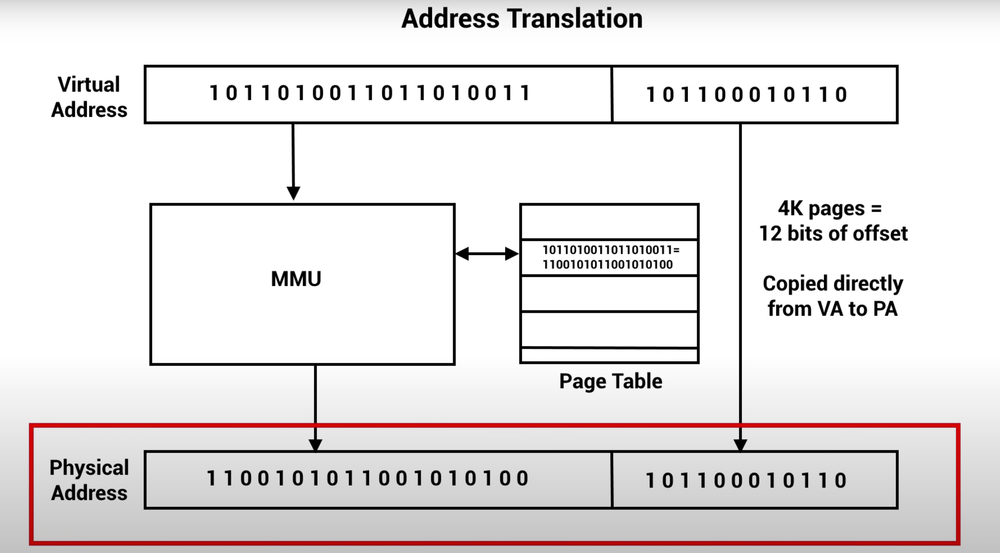

# MEMORY MANAGEMENT
## Process Memory in physical memory (RAM) 
[Source - GeeksforGeeks](https://www.geeksforgeeks.org/memory-layout-of-c-program/) <br />

When a program is loaded onto memory, it becomes a process. The layout looks like this.<br />
 <br />
**Note:** The bss section is not automatically initialized. See bss notes. <br />
Predominantly there are 5 sections: <br/>
* **Stack** - Stack is fixed size buffer which holds stack frames during a function call.grows from high address to lower address. LIFO.    
    * Stack frame - A set of values pushed for one function call. Return address(atleast), Local variables, Machine registers.
    * [Stack Overflow](https://www.techtarget.com/whatis/definition/stack-overflow) - A stack overflow is a type of buffer overflow error that occurs when a computer program tries to use more memory space in the call stack than has been allocated to that stack. Can happen through recurssion without exit, longer recurssion logic or larger local variable memory block.
* **Heap** - dynamically allocated memory (runtime allocations). The allocation functions provide contiguous blocks of memory. Heap overflow can happen if memory not deallocated properly.
* **Uninitialized Data (bss)** - BSS Segment. Contains uninitialized global, static variables. The default value of that variable is whatever (garbage) value happens to already be in that memory address! [source](https://www.learncpp.com/cpp-tutorial/uninitialized-variables-and-undefined-behavior/)
* **Initialized Data** - Data Segment. Contains initialized global and static variables.
* **Text** - code section. read-only (prevents modification). lower address to avoid heap and stack overwriting it.

## Physical memory
8 bit / 16 bit microcontrollers have only a few programs running. Therefore the space allocated on physical memory (RAM) is directly accessable. We can directly access the physical memory due to the knowledge of physical memory addresses.
The physical memory and the memory used is small too. <br />
16 bit address bus => 65536 addresses. (byte-addressable.) <br />
Byte Addressable is one byte can be represented by one address. <br />
**Disadvantages of using physical memory directly** <br />
* **Position.** Where does each program reside in memory ?
* **Overwriting** possibility between processes.
* **Relative Addressing.** Accidentally accessing other processes memory when doing address calculation.
* **Memory Fragmentation.** (Gaps in memory due to process placement, can't fit anything else. memory waste or full) <br />
***To solve this issue -> Virtual Memory.***

## Virtual Memory
[My Notes](https://drive.google.com/file/d/1SSlOTgJ-pYaVOjaNuXDhkvkRWUFOlatE/view?usp=share_link) <br />
[Youtube source - Gary Sims](https://www.youtube.com/watch?v=2quKyPnUShQ) <br />
Each App or Process running thinks its the only process running. It thinks it has the whole memory to play with and therefore need not worry about accessing other process memory. <br />
The OS is responsible to handle and partition the memory space. <br />
Also, physical memory (RAM) may be smaller than the possible 32 bit address space (4 GB).<br />

Catch - **Memory Management Unit (MMU) Hardware** <br />
Using a lookup table, the MMU can translate the virtual address of an app to an address in physical memory.
 <br />

**One-to-one mapping** <br />
 <br />
* MMU handles mapping virtual address to physical address of blocks (even if not contiguous) for an app. 
* No memory fragmentation. Even small blocks can be mapped by the MMU.
* App is contained within its own virtual address space and mapping ensures we are not getting into another process space. 

**Issue with One-to-one mapping**
The lookup table holding the virtual to physical memory mapping itself is very huge as we are mapping each byte in the memory. The book-keeping itself becomes very large. <br />
*For example:* <br />
```
300 MB program = 314,572,800 bytes.
If system is byte-addressable:
1 byte = 1 mapping entry.
Therefore, 314,572,800 entries needed for mapping. 
If 1 entry = 4 bytes;
Book-Keeping storage = 1,258,291,200 bytes = ~1.17 GB
```
This is just for one program. <br />
To get around this => Paging.

## Paging
[My Notes](https://drive.google.com/file/d/1SSlOTgJ-pYaVOjaNuXDhkvkRWUFOlatE/view?usp=share_link) <br />
[Youtube source - Gary Sims](https://www.youtube.com/watch?v=2quKyPnUShQ) <br />
 <br />
Divide the Memory into blocks, typically 4 KB each. Each block is called pages. <br />
The mapping is between virtual memory page to physical memory page. The starting address of that page is taken. <br />
The lookup table is called **page table**. <br /> 
The book-keeping storage is significantly reduced.
```
300 MB program = 314,572,800 bytes = 307,200 KB
1 block(page) = 4 KB.
=> 300 MB program = 307,200 / 4 = 76800 blocks.
1 block = 1 mapping entry.
Therefore, 76800 entries needed for mapping. 
If 1 entry = 4 bytes;
Book-Keeping storage = 307,200 bytes = ~0.29 MB (significantly less)
```
What happens when the address is in the middle of the page.
The offset gets directly copied. The addresses are mapped and translated.
```
4KB = 4096 bytes = 12 bits => offset size.
If 32 bit system ; 20 bits => page address. 
```
 <br />

## Where are these lookup/page tables held?
Not in CPU, but in **RAM**. <br />
This results in multiple RAM accesses. One to access the table itself, which will require one translation to get physical address of the table and the other to actually get the mapping for the process.
This slows down the whole process. Therefore, we cache it.

## TLB Cache
20 to 30 entries generally. Can be bigger. Only checks for pages. <br />
If we are running instructions within the page, we will always have a TLB hit as the translation for the page address is already cached. <br />
[LRU Cache](../LRU_cache/LRU_Cache.cc) implementaion is used for the Cache. The least recently used mapping is removed.

## Page Fault
If the mapping is not found. MMU raises the page fault and signals the kernel.
* App trying to access forbidden address, not allocated to it. Seg fault issued by OS.
* **Lazy Allocation** kernel maps it, but the physical memory is not allocated. It is allocated only after writing starts to it. Redoes the process.
* **Memory Swapped** kernel gets it from compressed RAM (z-swap) or disk, uncompresses it and places it in the physical space, reprograms the MMU and updates the mapping.
