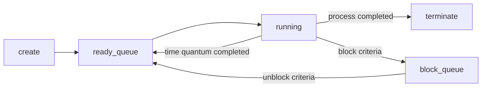
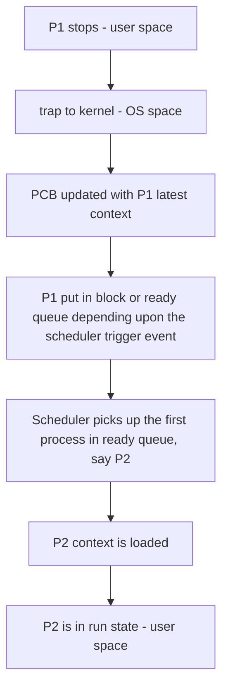

# PROCESS

[My Notes based on UPenn Lectures](https://drive.google.com/file/d/1aYTq_zreyI6VwZuPKOl_k7kOrtvZsZOZ/view?usp=share_link) <br />
[Basic Intro](https://www.tutorialspoint.com/operating_system/os_processes.htm) <br />

## Program
A program is a piece of code. This is typically our source code. A collection of computer programs, libraries and related data are referred to as a software.

## Executable
For a machine to read the program, we need the executable. This is a file that the specific processor can understand. <br />
The instructions in the executable are executed by a processor directly. A binary file, however, can have text strings (ASCII and/or Unicode).

[Compilation process](https://hackthedeveloper.com/c-program-compilation-process/) for getting a binary executable. <br />
 <br />

## Process & Process Memory in RAM.
When a program is loaded onto memory, it becomes a process. It is a program in execution. It's a running instance from an executable.<br />
See [Memory Management](memory_management.md) for detailed memory analysis.

## Process Context & Process Control Block (PCB)
Current state of the process. It consist of the following: (memorize as **P-EMF-S**)
* [P - Process Info]
    * Process ID
    * Parent process pointer
    * Priority 
    * time limits
* [E - Execution State] 
    * Stack Pointer
    * Program Counter
    * CPU registers
    * Current State - running, blocked, ready. (See below)
* [M - Memory management info] 
    * pointer to page table
    * memory limits
* [F - file descriptors] 
    * I/O devices info.

The **PCB** is a list of process contexts and is updated whenever there is a new process created or a context switch. <br />
The PCB is maintained for a process throughout its lifetime, and is deleted once the process terminates. 

## Process Life Cycle / Process States
[Source - tutorials point](https://www.tutorialspoint.com/operating_system/os_processes.htm)



## Context Switching (CS)

**Trap** - Mode Switch from User space to kernel (OS space) <br />
When does trap and subsequent CS happens:
* Scheduler - Time quantum met (or) priority based.
* System call in the process. *May not always block the process, but CS happens.*
* Software / Hardware Interrupts.
* Termination of process.

When a process is interrupted by kernel for any reason mentioned above, the scheduler picks a new process to run. So the switch from one process context to other is **context switching**. <br />

The flow is as follows:


## Process Related System Calls
[fork() and exec() - GeeksforGeeks](https://www.geeksforgeeks.org/difference-fork-exec/) <br />
The above creates child processes.

[wait() - GeeksforGeeks](https://www.geeksforgeeks.org/wait-system-call-c/) <br />
The above is very important in the parent context. The parent has to wait(), ie. be in the block queue (and not busy wait) to get atleast one child process termination status. <br />
It doesn't wait for all. To wait for all, do this.
```
while(wait(NULL) > 0); 
(or)
waitpid(pid, &status, options); // for every child.
```
This is to reap the processes, ie. have a good track on the PCB entries. The parent continues after waiting.

| system call | function |
|---|---|
| fork()                        | Clone the virtual memory process space. Point to that address and get the new pid for child   |
| exec()                        | Load the new bin. Reset everything in the virtual memory space.  | 
| wait(&status)                 | As per above.  | 
| waitpid(pid, &status, options)| Child specific wait.  | 
| exit(status)                  | Process termination. child populates status. status = 0 => graceful termination.  | 
| kill(pid, sig)                | Immediate process kill with SIGKILL. memory and resources freed. There are more signal types.  |   

```
// Simple code

pid = fork();
// parent.
if(pid != 0)
{
    wait(&status); // wait for child to terminate.
    exit(0);
}
// child.
else
{
    exec("bin/ls");
}
```

## Types of process children
[Source - Scalar](https://www.scaler.com/topics/operating-system/zombie-and-orphan-process-in-os/)
* **Orphan:** 
    * Parent process exits before child process termination. Parent therefore would have not called wait(). Adopted by init process.
    * Init process calls wait and gets return value of child process on its termination and cleans the PCB entry.
* **Zombie:** 
    * Child process exits before Parent even reaches wait() call.
    * Memory and resources are freed on child termination.
    * Return value of wait() not retrieved from child termination. Therefore, PCB enrty is not cleaned up so entry still exists. 
* **Daemon:** 
    * Init process children. (bg/sys level)

## System Calls and difference from function calls

**Flow of a function call** <br />
No Context Switch here. Everything happens in the user space.
1. Push - local variables, arguments (pass by values), CPU registers (data regs and PC) at function call to stack.
2. Do the function op.
3. Pop  - all values
4. Push - return value.
5. Pop  - return value and go back to PC.

### System call<br />
[List of services from OS (kernel APIs)](https://www.geeksforgeeks.org/introduction-of-system-call/) <br />
The kernel has a list of services that the app can request from. Here we need to enter the OS space to get those services running. Therefore, context switch exists. These services are in the form of APIs which provides the apps a way to interact with the OS. <br />
Some services: <br />
* Process creation and management Eg. fork, exec.
* Main memory management Eg. malloc
* File Access, Directory and File system management Eg. fopen, fclose.
* Device handling(I/O) Eg. read, write, print.
* Networking. Eg. socket 

**Flow of a system call** <br />
1. Push - system call #(number), system call arguments, register values (data and PC). [user mode]
2. Context switch starts. Trap to kernel [OS mode]. 
3. Pop - register values. -> Populate PCB for the process P1 invoking the system call. 
4. Pop - system call # and its arguments. -> corresponding system call requested via dispatcher.
5. Push - return value of the system call. Process put in block queue, if return value not received. 
6. Scheduler decides next process (P2) from ready queue.
7. Registers updated with the selected process (P2) PCB contents.
8. Kernel to User space. New process (P2) starts running.
9. Pop - return value when received for the process. The process P1 goes from block to ready queue.

Process stack is used for the system call. Direct CPU copy to PCB also. <br />
Context Switch interleaved into the process.

## Process synchronization (Inter-Process Communication IPC)
* Pipe https://www.geeksforgeeks.org/pipe-system-call/
* Shared Memory
* [Local Socket](../socket_programming/README.md)
* Signaling
