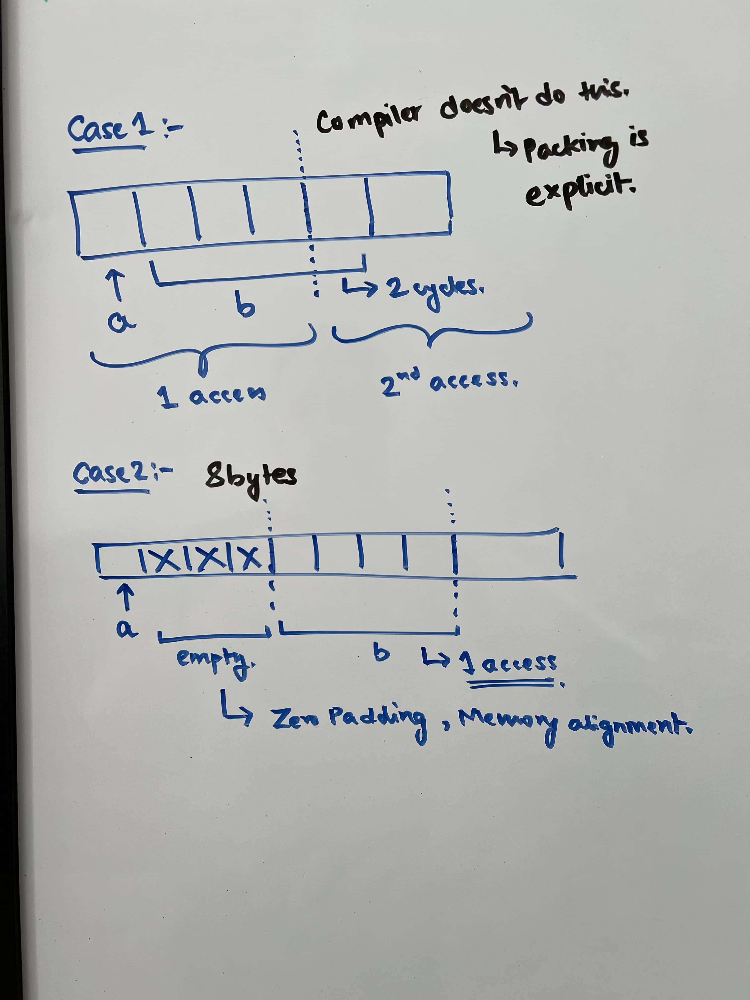
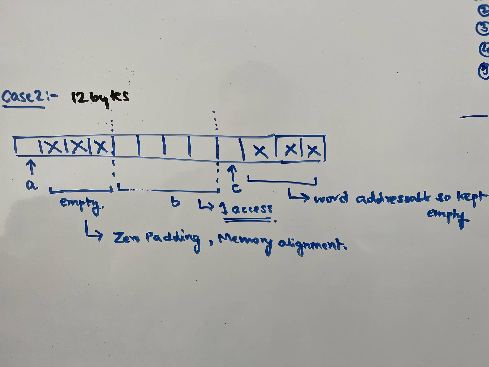
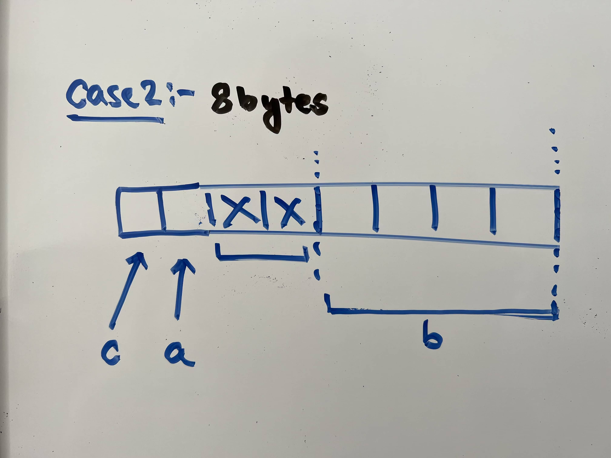
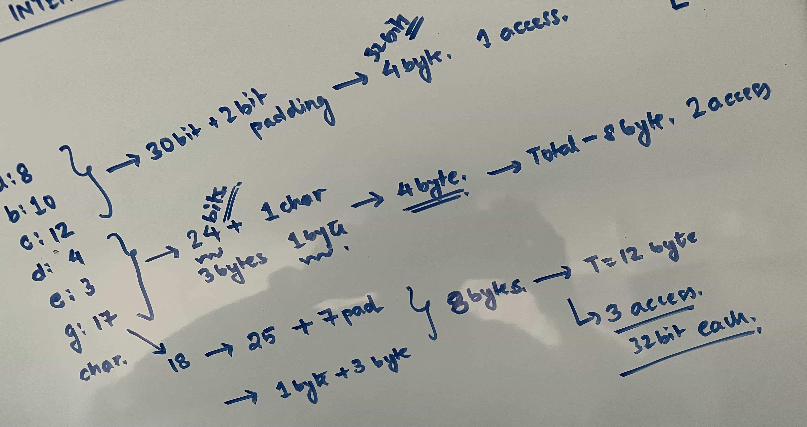

# Structure Padding

Detailed analysis in the link below: <br />
http://www.catb.org/esr/structure-packing/ <br />
Other links: <br />
https://www.youtube.com/watch?v=LZYgXaMeor0 <br />
https://www.scaler.com/topics/structure-padding-in-c/ <br />
https://www.fresh2refresh.com/c-programming/c-structure-padding/

A structure is always given a **contiguous** block in memory and the members are stored **sequentially**.

Questions to take care when a structure is given:
* Structure Padding there?
* Address bus size ? Byte Addressability?
* Compiler size comprehension (int is 2 bytes or 4) ?

Based on machine address bus size. <br />
It can be:
* Byte Addressable (8 bit machine)
* 2-Byte Addressable (16 bit machine)
* Word Addressable (32 bit machine)[Can access 4 bytes at time]
* Word Addressable (64 bit machine)[Can access 8 bytes at time]

This means processor can access the number of bytes at one time. <br />
So for example, byte addressable machine with take 4 CPU cycle to access int(assuming 4 bytes). Word addressable machine would do it in 1 cycle.
```
struct abc
{
    char a;
    int b;
}
```
If the above is in word (4 bytes) addressable universe and no structure padding, <br /> 
* In 1 CPU cycle - *char a* and 3 bytes of *int b* are accessed.
* Remaining 1 byte in the next CPU cycle. 
* To access *int b*, always 2 CPU cycles needed. Which is slowing the performance.
* With padding, *int b* can be accessed in 1 cycle itself.

 

**Memory Alignment / Structure Padding Considerations** <br />
* Perfomance increase (less CPU cycles to access the member).
* But inefficient use of memory. Holes exists.
* Compiler does the zero padding. Largest member based window size.
* If very large number of structs with padding, huge memory wastage.

Now consider the following.
```
struct abc
{
    char a;
    int b;
    char c;
}
```
Zero Padding sends it further.

 

To avoid Memory wastage, we align the members properly.
```
struct abc
{
    char c;
    char a;
    int b;
}
```

 

The above is as per youtube lecture. It's advisable to have the largest member at the start.

### Special Case 
**where the member is bigger than address accessibility.**

Here assume its 2-byte addressable.
```
struct packet
{
 uint16_t a;
 uint32_t b;
 uint16_t c;
 uint16_t d;
}
```
[Solution Source](http://www.catb.org/esr/structure-packing/)
* In general, a struct instance will have the alignment of its **widest scalar member**. 
* Compilers do this as the easiest way to ensure that all the members are self-aligned for fast access.
* **Arrange members in decreasing order** of size.

[See code for compiler results](test.c)

## Bitfields
[Source](http://www.catb.org/esr/structure-packing/) <br />
Exact number of bits are assigned to the members. Bits are then padded to accomodate access. <br />
```
32 bit compiler.
    struct a3
    {
        short a;   // 2 bytes
        char b;    // 1 byte
        int c : 1; // 1 bit
        int d : 4; // 4 bit
        // 3 bits padded. -> 1 byte complete formed.
        // so here, 32 bits / 4 bytes accessed per CPU cyle.
        int e : 7; // 7 bit
        // this is the next CPU cycle. This picks up 32 bits.
        // since we want a good memory access in next cycle, 25 bits a padded.
    };
```
 

[See code for compiler results](test.c)

# Structure Packing
This avoids any padding and we get the exact size based of the size of members.
```
#pragma pack(1) // pack in 1 byte boundry. inefficient memory access.
__attribute__((packed))
```